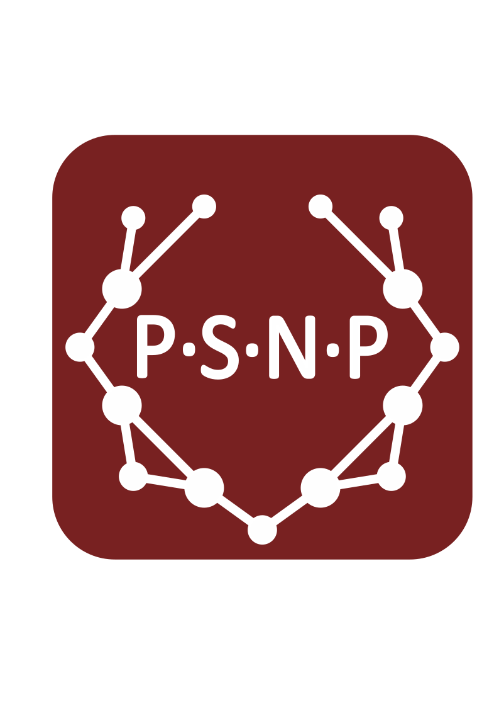

# Meaningful title for the repository

## About
[In two to three sentences state the purpose of this repository, e.g., The purpose of this repository is to provide templates for all future PSN repositories in order to save precious time and maintain high standards and uniformity of our documentation.]

## Authors
* Petra Hermankova 
* [Name], [ORCID], [Institution], 
* [Name], [ORCID], [Institution]
* [Name], [ORCID], [Institution]

## Funding
*The Past Social Networks Projects* is funded by the Carlsberg Foundation, Semper Ardens Accelerate no. XXX in 2022-2026. 

## License
CC-BY-SA 4.0, see attached [License.md](./License.md)

## Data
[Describe the provenance of data used in the scripts contained and clarify how it is harvested and what other prerequisites are required to get the scripts working. In case of pure tool attribute any reused scripts to source, etc., license and specify any prerequisites or technical requirements. Provide information on data metadata and data used. Provide a link to a data repository or explanatory article.] 

## Scripts
[Describe what individual scripts do, provide links to them, and order them in a sequence they should run. Point to any issues or specific settings people should be aware of.]

## Screenshots

## DOI
TBA

## How to cite us
TBA

---

